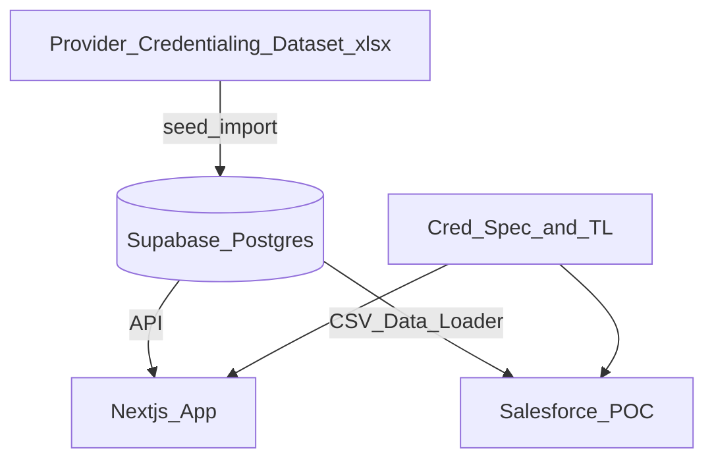
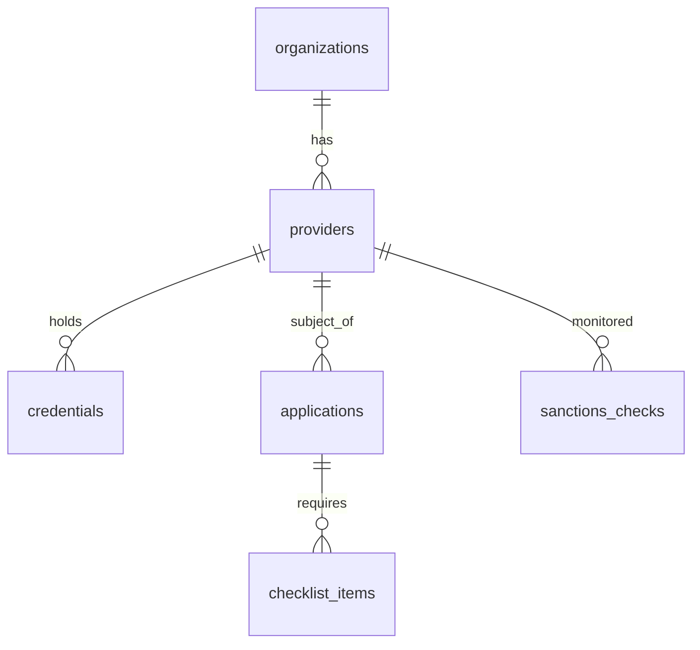
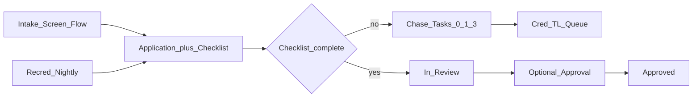

# Credentialing POC — Architecture

Lean proof-of-concept architecture. Print/PDF twin: [poc-architecture-print.md](poc-architecture-print.md) · [poc-architecture.pdf](poc-architecture.pdf).

## System context

## Logical data model

## Salesforce workflow spine

## Layers

| Layer | Responsibility |
| --- | --- |
| Excel workbook | Synthetic practitioners + facilities |
| Supabase | POC system of record for demo data |
| Next.js | App UX: lists, detail, expirations |
| Salesforce | Intake, checklist gate, chase, recred, Physician 360 (standard pages) |

See [README.md](README.md) for the full document pack.
