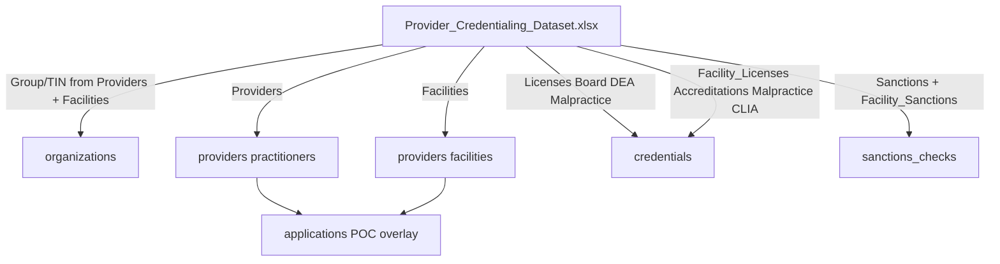
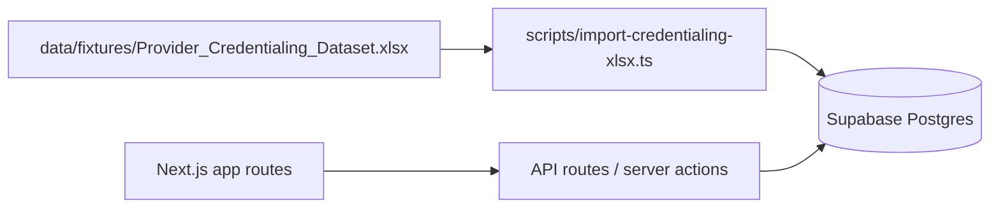

# Credentialing POC — Development Start Plan

**PDF:** [poc-development-plan.pdf](poc-development-plan.pdf) · **Print source:** [poc-development-plan-print.md](poc-development-plan-print.md)

See the full pack: [docs/README.md](README.md) (friction map, Cred POC Start, SFDC plan).

Prove **intake → checklist gate → status orchestration → recred/expiration queue** for **practitioners and facilities**, seeded from **one** updated workbook.

**Source workbook:** `Provider_Credentialing_Dataset.xlsx` (extend in place with synthetic facilities; copy into `data/fixtures/` for the app).

**Locked approach:** extend the spreadsheet itself with synthetic facilities. Do not use a separate `facilities.json`.

---

## Workstream checklist

| ID | Task | Status |
| --- | --- | --- |
| extend-xlsx-facilities | Update workbook: Facilities master + facility credential/monitoring sheets (~8 facilities) | Pending |
| vendor-dataset | Copy updated workbook to `data/fixtures/Provider_Credentialing_Dataset.xlsx`; document sheet→table mapping | Pending |
| schema-migration | Supabase migration: organizations, providers (`practitioner` \| `facility`), credentials, sanctions_checks; POC overlays | Pending |
| import-seed | Seed script: parse single xlsx, upsert all subjects/credentials, derive POC applications | Pending |
| align-types | Update `src/types` for practitioners, facilities, credential kinds, sanctions | Pending |
| wire-supabase | Install clients, env, API list/detail queries (filter by `subject_type`) | Pending |
| poc-behaviors | Intake, checklist gate, outreach, recred queues for both subject types | Pending |
| docs | Update `docs/architecture.md` with workbook provenance, ER, success criteria | Pending |

---

## Phase 0 — Extend the workbook (do first)

Update the Excel file, then copy to [`data/fixtures/Provider_Credentialing_Dataset.xlsx`](../data/fixtures/Provider_Credentialing_Dataset.xlsx).

### Keep existing sheets

| Sheet | Rows | Role |
| --- | --- | --- |
| `README` | — | Update to document facilities sheets, join keys, and status flag logic |
| `Providers` | 42 | Practitioners unchanged |
| `Licenses` / `Board_Certifications` / `DEA_Registrations` / `Malpractice_Insurance` | — | Practitioner credentials |
| `Sanctions_Exclusions_Monitoring` | 42 | Practitioner monitoring |

### Add facility sheets

| New sheet | Approx rows | Purpose |
| --- | --- | --- |
| `Facilities` | ~8 | Master facility subjects (parallel to `Providers`) |
| `Facility_Licenses` | ~8 | State facility / operating licenses |
| `Facility_Accreditations` | ~8 | AAAHC / Joint Commission / CARF / etc. |
| `Facility_Malpractice` | ~8 | Entity liability / malpractice |
| `Facility_Sanctions_Monitoring` | ~8 | OIG/SAM/NPDB-style (or facility exclusion) checks |

Optional: `Facility_CLIA` (~2–3 rows for lab-type facilities only).

### `Facilities` columns (aligned to Providers where possible)

- `Facility ID` (e.g. `FAC-2001`…) — join key for child sheets
- `Facility Name`
- `Facility Type` — ASC | Imaging | Clinic | SNF | Urgent Care | Lab | PT
- `NPI` (Type 2 where applicable)
- `Group/TIN Entity` + `TIN` — prefer linking to the existing five groups; allow 1 independent facility org if needed
- `Practice State`
- `Credentialing Status` — Active | Pending Recredentialing | Provisional | Under Committee Review
- `Cred. Effective Date` / `Cred. Expiration Date` — NCQA-style 3-year cycle
- `Days to Recred. Expiration` / `Recred. Status Flag` — same Excel formulas as Providers (`EXPIRED` / `EXPIRING SOON` ≤90 days / `ACTIVE`)

### Synthetic facility mix (~8)

Examples to author in-sheet:

- Coastal Ambulatory Surgery Center (ASC) → Coastal Medical Group
- Harborview Imaging Center → Harborview
- Sunrise Behavioral Health Clinic → Sunrise
- Meridian Skilled Nursing → Meridian
- Vanguard Urgent Care — Midtown → Vanguard
- 2–3 more (lab / PT / independent ASC) with mixed Active / Pending Recredentialing / Provisional and at least one expired + one expiring-soon accreditation or license

Child sheets join on `Facility ID`. Use real Excel dates so formulas behave like the practitioner file.

### README updates

Document: sheets list, `Facility ID` join key, facility vs practitioner subject types, same status-flag and recred-cycle rules, and that all facility data is synthetic.

---

## Dataset → Supabase mapping

- **organizations:** distinct Group/TIN from both Providers and Facilities
- **providers:** `subject_type = practitioner | facility`; `external_id` = `PRV-*` or `FAC-*`
- **credentials:** typed kinds for both; facility kinds include `facility_license`, `accreditation`, `malpractice_insurance`, optional `clia`
- **sanctions_checks:** both subject types
- **applications / checklist / outreach:** thin POC overlay after import (not columns in Excel)

Excel serial/formula dates: store ISO dates in Postgres; **recompute** expiry flags in app/SQL from `expires_at` / `cred_expiration_date`.

---

## Architecture (POC)

**Defaults locked:**

- Single workbook is the only seed source for practitioners **and** facilities
- Status advances via API
- Auth stubbed for local POC
- 90-day expiring-soon window; 3-year recred via cred expiration dates

---

## Phase 1 — Schema + import

Replace [`supabase/migrations/00001_init.sql`](../supabase/migrations/00001_init.sql).

### Core tables

| Table | Purpose |
| --- | --- |
| `organizations` | From Group/TIN on both master sheets |
| `providers` | Practitioners + facilities (`subject_type`) |
| `credentials` | All credential child sheets |
| `sanctions_checks` | Both monitoring sheets |

### POC overlays

| Table | Purpose |
| --- | --- |
| `applications` | new \| recred; path `caqh` \| `in_house` \| `facility` \| `delegated` |
| `checklist_templates` / `checklist_items` | Separate practitioner vs facility templates |
| `outreach_attempts` | 3-attempt chase |
| `documents` | Optional metadata stub |

### Application status

`draft` → `incomplete` → `in_review` → `pending_committee` → `approved` | `denied` | `termed` | `withdrawn`

### Import script

[`scripts/import-credentialing-xlsx.ts`](../scripts/import-credentialing-xlsx.ts):

1. Read the updated fixture xlsx
2. Convert dates → ISO
3. Upsert orgs, practitioners, facilities, credentials, sanctions
4. Derive POC applications/checklist/outreach for both subject types
5. `npm run seed:credentialing`

Align [`src/types/`](../src/types/) with imported columns.

---

## Phase 2 — Wire Supabase

1. Install `@supabase/supabase-js` + `@supabase/ssr`
2. Implement [`src/lib/supabase/client.ts`](../src/lib/supabase/client.ts) and [`server.ts`](../src/lib/supabase/server.ts)
3. Env from [`.env.example`](../.env.example)
4. Real queries in API routes under `src/app/api/`
5. List/detail pages under `src/app/(app)/` with Practitioner/Facility filter; detail shows child credentials + sanctions

---

## Phase 3 — Four POC behaviors

1. **Intake** — choose practitioner vs facility; instantiate matching checklist; block advance if incomplete
2. **Status machine** — advance only when checklist complete
3. **Outreach** — attempts on incomplete apps (include at least one facility incomplete)
4. **Recred / expirations** — [`expirations`](../src/app/(app)/expirations/page.tsx) for both subject types; “Create recred application” when no open recred app

Also update [`docs/architecture.md`](architecture.md) with workbook provenance, ER summary, and success criteria.

---

## Out of scope

- Live Aperture / VC / CAQH APIs
- Cat A/B committee UI
- Bulk delegated NetSub loads
- Certified mail
- Salesforce metadata
- A separate facilities JSON/CSV fixture

---

## Success criteria

- Workbook contains Facilities + facility child sheets with ~8 synthetic facilities
- Import loads **42** practitioners, **~8** facilities, orgs from both, and all credential/sanctions rows from the **single** xlsx
- UI lists/filters practitioners and facilities
- Facility incomplete app blocked from `in_review`
- Expirations show expired / expiring-soon for both
- Happy path works for one practitioner and one facility
